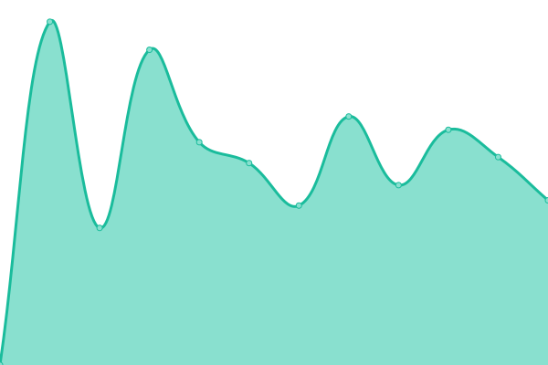
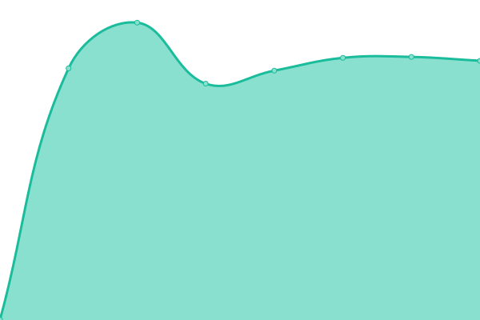
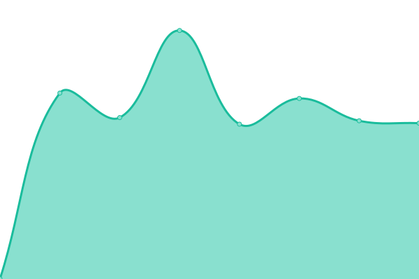
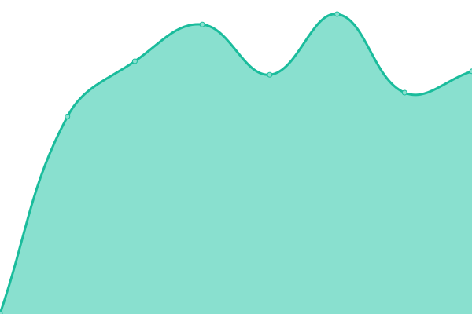

# [📈 Live Status](https://status.bornerecharge.fr): <!--live status--> **🟩 All systems operational**

This repository contains the open-source uptime monitor and status page for [Borne Recharge Service](https://bornerecharge.fr), powered by [Upptime](https://github.com/upptime/upptime).

With [Upptime](https://upptime.js.org), you can get your own unlimited and free uptime monitor and status page, powered entirely by a GitHub repository. We use [Issues](https://github.com/BorneRecharge/uptime/issues) as incident reports, [Actions](https://github.com/BorneRecharge/uptime/actions) as uptime monitors, and [Pages](https://status.bornerecharge.fr) for the status page.

<!--start: status pages-->
<!-- This summary is generated by Upptime (https://github.com/upptime/upptime) -->
<!-- Do not edit this manually, your changes will be overwritten -->
<!-- prettier-ignore -->
| URL | Status | History | Response Time | Uptime |
| --- | ------ | ------- | ------------- | ------ |
|  [Website BRS](https://bornerecharge.fr) | 🟩 Up | [website-brs.yml](https://github.com/BorneRecharge/uptime/commits/HEAD/history/website-brs.yml) | 

 2171ms
     
 | 

<a href="https://status.bornerecharge.fr/history/website-brs">100.00%</a>
    

|  [Website BRPark](https://brpark.fr) | 🟩 Up | [website-br-park.yml](https://github.com/BorneRecharge/uptime/commits/HEAD/history/website-br-park.yml) | 

 2717ms
     
 | 

<a href="https://status.bornerecharge.fr/history/website-br-park">100.00%</a>
    

|  [Portail client](https://portail.bornerecharge.fr/) | 🟩 Up | [portail-client.yml](https://github.com/BorneRecharge/uptime/commits/HEAD/history/portail-client.yml) | 

 2153ms
     
 | 

<a href="https://status.bornerecharge.fr/history/portail-client">100.00%</a>
    

|  Supervision 4SH | 🟩 Up | [supervision-4-sh.yml](https://github.com/BorneRecharge/uptime/commits/HEAD/history/supervision-4-sh.yml) | 

 703ms
     
 | 

<a href="https://status.bornerecharge.fr/history/supervision-4-sh">100.00%</a>
    

|  Supervision BRS | 🟩 Up | [supervision-brs.yml](https://github.com/BorneRecharge/uptime/commits/HEAD/history/supervision-brs.yml) | 

 1829ms
     
 | 

<a href="https://status.bornerecharge.fr/history/supervision-brs">100.00%</a>
    

|  Supervision BRS (legacy route) | 🟩 Up | [supervision-brs-legacy-route.yml](https://github.com/BorneRecharge/uptime/commits/HEAD/history/supervision-brs-legacy-route.yml) | 

 2490ms
     
 | 

<a href="https://status.bornerecharge.fr/history/supervision-brs-legacy-route">100.00%</a>
    

<!--end: status pages-->

[**Visit our status website →**](https://status.bornerecharge.fr)

## 📄 License

- Powered by: [Upptime](https://github.com/upptime/upptime)
- Code: [MIT](./LICENSE) © [Borne Recharge Service](https://bornerecharge.fr)
- Data in the `./history` directory: [Open Database License](https://opendatacommons.org/licenses/odbl/1-0/)
